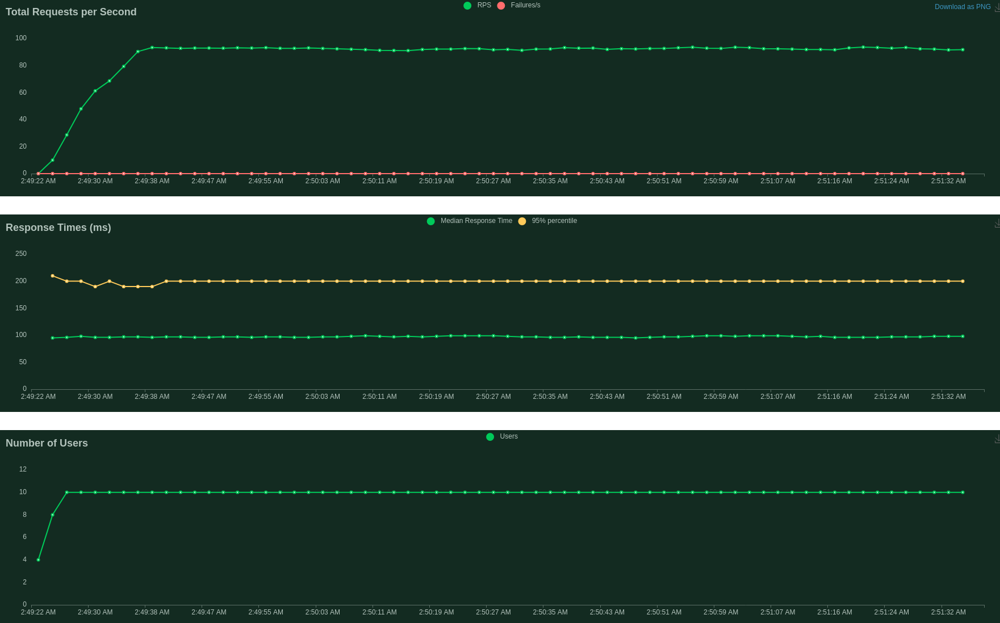

# Authentication Microservice Performance Testing

## Locust tasks

#### Authentication (signin, refresh, userinfo, signout)

Use for testing all Auth APIs

```py
    @task
    def tester(self):
        response = self.client.post("/signin", json={
            "email": self.user,
            "phone_number": "",
            "password": self.password,
        })
        if response.status_code != 200:
            print(response.json())
            return
        json_response = response.json()
        response = self.client.post("/refresh", headers={
            "Authorization": json_response['refresh_token']
        })
        if response.status_code != 200:
            return
        json_response = response.json()
        response2 = self.client.post("/userinfo", headers={
            "Authorization": json_response['access_token']
        })
        if response2.status_code != 200:
            return
        json_response2 = response2.json()
        if json_response2['email'] != self.user:
            return
        self.client.post("/signout", headers={
            "Authorization": json_response['access_token']
        })
```


## Performance Test

Use **_locust_** tool for testng

#### Total Request Per Second, Response Time & Number of Users

<p></p>


