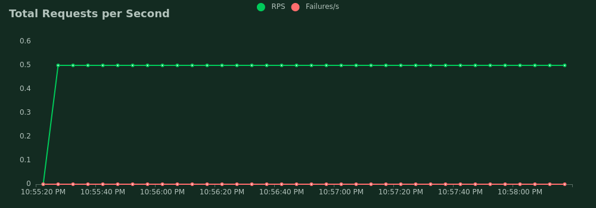
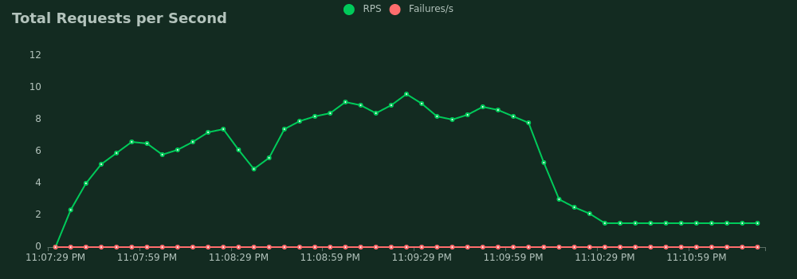
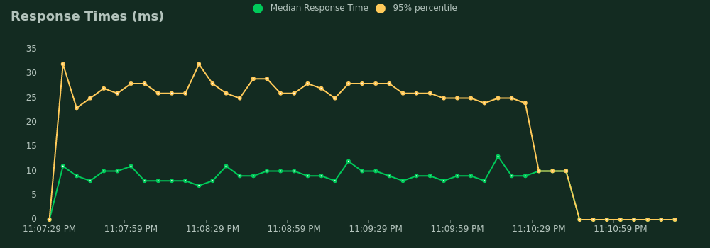

# Ticket Microservice Performance Testing

## API Reference

#### Get flights' tickets

```http
GET /flights
```

| Parameter       | Type     | Description                                    |
|:----------------|:---------|:-----------------------------------------------|
| `origin`        | `string` | **Required**. flight origin                    |
| `destination`   | `string` | **Required**. flight destination               |
| `departureDate` | `date`   | **Required**. departure date                   |
| `returnDate`    | `date`   | **Optional**. return date for _**round trip**_ |

---

#### Get user purchased tickets

```http
GET /dashboard/tickets
```

use `Auth2` as Authentication method.

---

#### Post a transaction

```html
POST /ticket
```

use `Auth2` as Authentication method

API `body` example:

```json
{
  "title": "string"
  // transaction title,
  "flight_serial": "number",
  //flight serial number
  "offer_class": "string"
  // flight class
  "offer_price": "number"
  // flight ticket price
}
```

---

## Locust tasks

#### Search Tickets

Use for testing `/flights` API

```py
    @task(3)
    def search_ticket(self):
        # search a ticket
        self.client.get(
            "/flights?origin=ADZ&destination=BTS&departureDate=2023-02-04&returnDate=2023-02-05",
            headers={
                "Authorization": 'JWT access token'
            }
        )
```

---

#### Purchase tickets history

Use for testing `/dashboard/tickets` API

```python
   @task
   def purchase_ticket(self):
        self.client.post("/ticket", json={
            "corresponding_user_id": 1,
            "title": "buying",
            "flight_serial": "23424",
            "offer_price": 110,
            "offer_class": "y"
        })
```

---


## Performance Test

Use **_locust_** tool for testng

#### Single User

Single user sending request with 1 to 4 seconds wait time.


<p></p>
<p></p>


#### Multi User

300 user sending request with 1 to 4 seconds wait time and spawn time of 2 seconds.


<p></p>
<p></p>